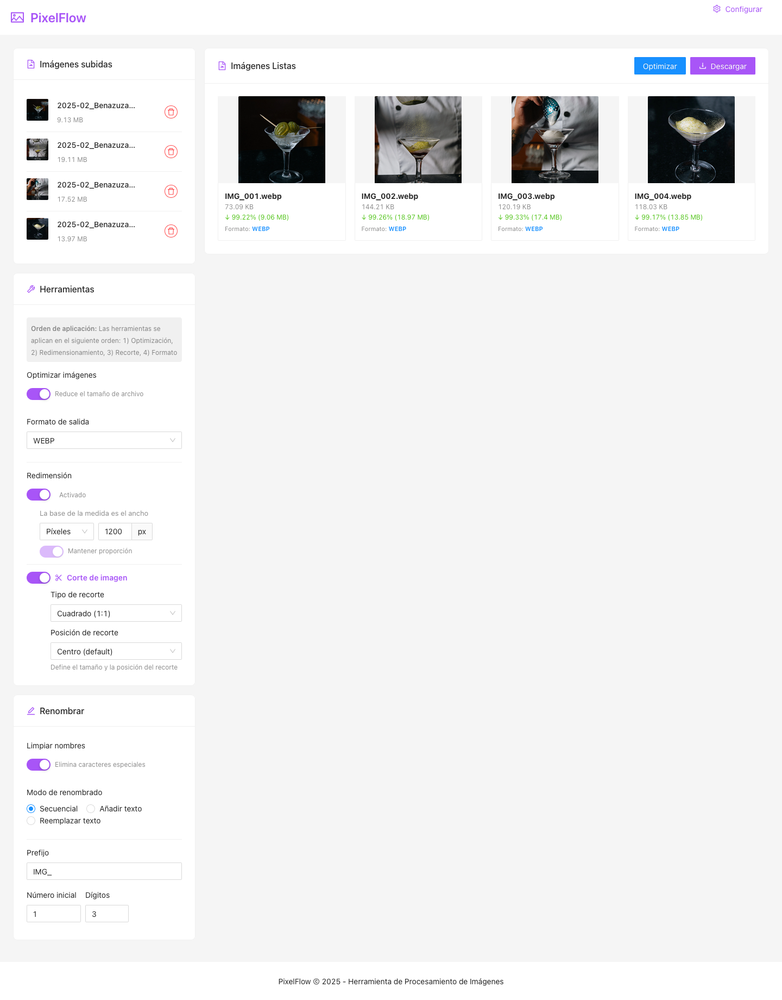

## Herramientas principales

PixelFlow ofrece un conjunto integral de herramientas para el procesamiento de imágenes, diseñadas para ser intuitivas y potentes al mismo tiempo. Todas las herramientas se aplican en un orden específico (1. Optimización, 2. Redimensionamiento, 3. Recorte, 4. Formato) para garantizar resultados óptimos.

### Formato de salida

Permite seleccionar el formato al que se convertirán las imágenes procesadas:


- **Original**: Mantiene el formato original de cada imagen
- **JPG**: Ideal para fotografías y donde no se requiere transparencia
- **PNG**: Mejor opción para gráficos con transparencia
- **WEBP**: Formato moderno con mejor compresión que ofrece buena calidad y tamaño reducido

### Redimensión

Permite cambiar el tamaño de todas las imágenes de manera uniforme:


- **Unidad**: Selecciona entre píxeles (tamaño exacto) o porcentaje (relativo al tamaño original)
- **Mantener proporción**: Conserva la relación de aspecto original (recomendado para evitar distorsiones)
- **Base de la medida**: La herramienta utiliza el ancho como referencia cuando se mantiene la proporción

### Corte de imagen

Permite recortar las imágenes según proporciones específicas, desde posiciones determinadas:


- **Tipo de recorte**: 
  - Cuadrado (1:1): Ideal para perfiles, miniaturas y fotografías de producto
  - Horizontal (16:9): Estándar para vídeo y presentaciones
  - Horizontal (4:3): Formato clásico para fotografías
  - Vertical (9:16): Formato para historias de redes sociales
  - Vertical (3:4): Formato para retratos y publicaciones verticales

- **Posición de recorte**: Define desde dónde se realizará el recorte (centro, esquinas, laterales)

# PixelFlow - Herramienta de Procesamiento de Imágenes

PixelFlow es una aplicación web para procesamiento de imágenes por lotes que permite a los usuarios subir, visualizar, editar y optimizar imágenes a través de una interfaz intuitiva y funcional.

## Vista previa de la aplicación

### Pantalla inicial


### Interfaz completa con imágenes cargadas



Con PixelFlow puedes cargar, procesar y optimizar múltiples imágenes simultáneamente, con herramientas intuitivas de procesamiento y opciones de configuración flexibles.

## Características

- **Carga de imágenes**: Arrastra y suelta o selecciona imágenes (hasta 60MB)
- **Optimización**: Reduce el tamaño de las imágenes manteniendo una buena calidad
- **Cambio de formato**: Convierte imágenes a JPG, PNG, WEBP o GIF
- **Redimensionamiento**: Cambia el tamaño de las imágenes especificando dimensiones
- **Recorte**: Selecciona una zona específica para recortar las imágenes
- **Renombrado**: Renombra archivos mediante diferentes opciones (secuencial, agregar texto, reemplazar texto)
- **Descarga**: Descarga imágenes individuales o todas en un archivo ZIP
- **Personalización de marca**: Agrega tu propio logo y personaliza los colores para adaptarse a la identidad visual de tu empresa

## Tecnologías utilizadas

- React.js
- Ant Design
- react-image-file-resizer
- browser-image-compression
- pica
- file-saver
- jszip
- localStorage (para persistencia de configuración)

## Instalación

1. Clona este repositorio:
```
git clone https://github.com/tu-usuario/pixelflow.git
cd pixelflow
```

2. Instala las dependencias:
```
npm install
```

3. Inicia la aplicación en modo desarrollo:
```
npm start
```

La aplicación estará disponible en [http://localhost:3000](http://localhost:3000).

## Uso

1. Arrastra y suelta imágenes o haz clic en el área de carga para seleccionarlas
2. Utiliza las herramientas del panel izquierdo para:
   - Activar/desactivar optimización
   - Cambiar formato de archivo
   - Redimensionar imágenes
   - Recortar imágenes
   - Renombrar archivos
3. Visualiza las imágenes procesadas en el panel derecho
4. Descarga las imágenes procesadas individualmente o todas juntas
5. Personaliza la apariencia usando el botón "Configurar" en la cabecera

## Personalización de marca

PixelFlow permite personalizar la apariencia de la aplicación para adaptarse a la identidad visual de tu empresa:

### Personalización de logo

1. Haz clic en el botón "Configurar" en la esquina superior derecha
2. En la sección "Logo y nombre" podrás:
   - Cambiar el nombre de la aplicación
   - Cargar tu propio logo (formatos recomendados: PNG o SVG con fondo transparente)
3. Verás una vista previa en tiempo real en la parte superior del panel
4. Haz clic en "Guardar configuración" para aplicar los cambios

### Personalización de colores

1. En el mismo panel de configuración, encontrarás la sección "Paleta de colores"
2. Puedes personalizar:
   - **Color primario**: Usado en botones, switches y elementos interactivos
   - **Color secundario**: Usado para acentos y detalles visuales
   - **Color de fondo**: Fondo general de la aplicación
3. Haz clic en cada selector de color para abrir una paleta donde puedes:
   - Seleccionar un color usando el selector visual
   - Introducir un código hexadecimal para coincidencia exacta con tu marca

### Persistencia de la configuración

- La configuración personalizada se guarda automáticamente en el navegador
- Se mantendrá entre sesiones hasta que borres los datos del navegador
- Si necesitas restablecer la configuración por defecto, usa el botón "Restablecer"

## Estructura del proyecto

```
src/
├── components/
│   ├── Common/          # Componentes comunes y de marca
│   │   ├── BrandLogo.jsx
│   │   ├── BrandConfigPanel.jsx
│   │   └── ColorPicker.jsx
│   ├── ImageUploader/
│   │   ├── UploadArea.jsx
│   │   └── UploadedImagesList.jsx
│   ├── ImageProcessor/
│   │   ├── ProcessedImagesList.jsx
│   │   └── ImageItem.jsx
│   ├── Tools/
│   │   ├── ToolsPanel.jsx
│   │   ├── FormatTool.jsx
│   │   ├── ResizeTool.jsx
│   │   ├── CropTool.jsx
│   │   └── OptimizeTool.jsx
│   ├── RenameTools/
│   │   ├── RenamePanel.jsx
│   │   ├── SequentialRename.jsx
│   │   ├── AddTextRename.jsx
│   │   └── ReplaceTextRename.jsx
│   └── DownloadButton.jsx
├── config/
│   └── brandConfig.js     # Configuración por defecto de marca
├── context/
│   └── BrandContext.jsx   # Contexto para gestionar configuración de marca
├── hooks/
│   ├── useImageProcessor.js
│   ├── useImageUpload.js
│   └── useImageRename.js
├── utils/
│   ├── imageProcessing.js
│   └── fileHelpers.js
└── App.jsx
```

## Licencia

Este proyecto está licenciado bajo la Licencia MIT - ver el archivo LICENSE para más detalles.

## Contacto

Si tienes alguna pregunta o sugerencia, no dudes en contactarme. 